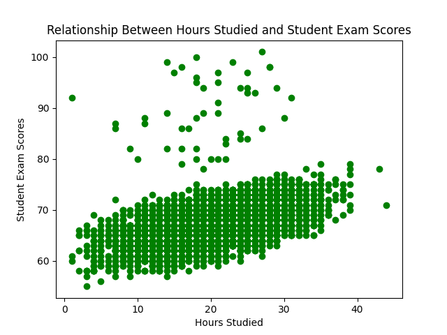

# Rishika Randev's Pandas Descriptive Script for IDS706 Week 3

## ☑️ Requirements (Individual Project 1):
1. Jupyter notebook performing descriptive statistics & tested with nbval plugin
2. Python script for statistics and generating one data visualization
3. Shared code in library file
4. Summary pdf or markdown file
5. Makefile that installs required packages, formats with Black, lints with Ruff, and tests notebook, script, and library
6. requirements.txt
7. Testing files for library and script
8. Successful CI/CD badges for each step of the workflow

## ☑️ The Dataset
The dataset used in this project is a synthetic, free dataset from Kaggle called [Student Performance Factors](https://www.kaggle.com/datasets/lainguyn123/student-performance-factors?resource=download). It contains various columns that could potentially impact student performance on exams, such as hours studied, hours slept, class attendance, tutoring sessions, and family income. The full list of columns can be viewed at the link above.

## ☑️ Steps
1. Prepare the necesary configuration files like the Dockerfile, devcontainer.json, Makefile, requirements.txt, and main.yml for GitHub Actions integration. Ensure that the requirements.txt lists all necessary packages (for example, matplotlib for visualizing and pandas for data manipulation) and pins to a specific version of those packages.
2. Create a library.py script with functions that will be shared across the Jupyter notebook and main.py file--
   * load_data()
   * generate_summary_stats()
   * grab_max()
   * grab_median()
   * grab_min()
   * generate_study_hours_viz()
   * generate_sleep_viz()
3. Create a main.py script with two functions--
   * summarize(): Using the Student Performance csv and summary statistics functions 
     from library.py, this function produces summary statistics (mean, median,
     mode, standard deviation, percentiles, max, and min) for each column
     of the dataframe.
   * create_visualizations(): generates scatterplot and histogram visualizations
    of the csv data using the respective functions from library.py.
4. Create test_main.py and test_lib.py scripts to test both files.
     
     
5. Create a [Jupyter Notebook](summary.ipynb) with the same code as the main.py script to easily show the outputs of the descriptive statistics and data visualization.
6. Using yml files, set up a GitHub Actions workflows so that every time changes are pushed to the repository, all of the Makefile commands are run to ensure that new code is properly formatted using Black, linted using Ruff, and tested using Pytest. 

  - `make install`
    
    

  - `make format`
    
    

  - `make lint`
    
    

  - `make test`
  
    

## ☑️ Summary File
The outputs of the descriptive statistics and visualization showing Hours Studied vs. Exam Scores are captured in this [pdf file](summary.pdf).
   

